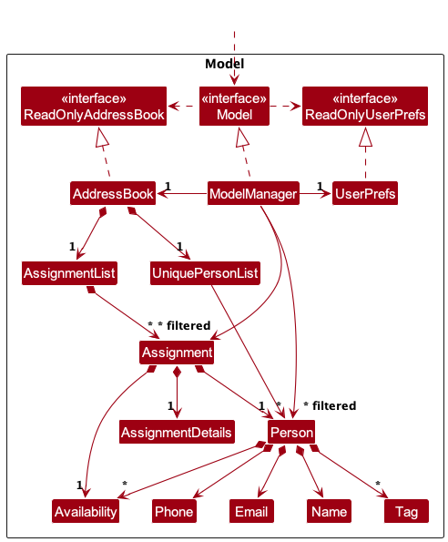
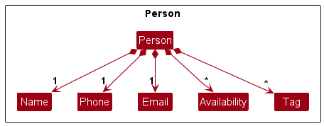
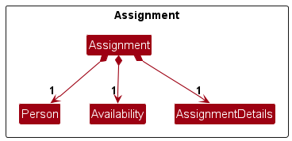
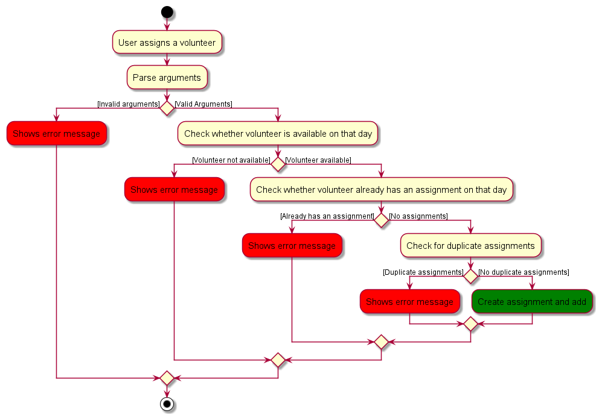

* Table of Contents
{:toc}

--------------------------------------------------------------------------------------------------------------------

## **Acknowledgements**

* The ListPanelView enum in our `CommandResult.java` is inspired from https://github.com/AY2324S1-CS2103T-W08-4/tp to implement switching views to assignment. Handling list panel view in `MainWindow.java` is also reused with modifications from the same source.

--------------------------------------------------------------------------------------------------------------------

## **Setting up, getting started**

Refer to the guide [_Setting up and getting started_](SettingUp.md).

--------------------------------------------------------------------------------------------------------------------

## **Design**

:bulb: **Tip:** The `.puml` files used to create diagrams in this document `docs/diagrams` folder. Refer to the [_PlantUML Tutorial_ at se-edu/guides](https://se-education.org/guides/tutorials/plantUml.html) to learn how to create and edit diagrams.

### Architecture

The ***Architecture Diagram*** given above explains the high-level design of the App.

Given below is a quick overview of main components and how they interact with each other.

**Main components of the architecture**

**`Main`** (consisting of classes [`Main`](https://github.com/AY2324S2-CS2103T-F10-4/tp/blob/master/src/main/java/seedu/address/Main.java) and [`MainApp`](https://github.com/AY2324S2-CS2103T-F10-4/tp/blob/master/src/main/java/seedu/address/MainApp.java)) is in charge of the app launch and shut down.
* At app launch, it initializes the other components in the correct sequence, and connects them up with each other.
* At shut down, it shuts down the other components and invokes cleanup methods where necessary.

The bulk of the app's work is done by the following four components:

* [**`UI`**](#ui-component): The UI of the App.
* [**`Logic`**](#logic-component): The command executor.
* [**`Model`**](#model-component): Holds the data of the App in memory.
* [**`Storage`**](#storage-component): Reads data from, and writes data to, the hard disk.

[**`Commons`**](#common-classes) represents a collection of classes used by multiple other components.

**How the architecture components interact with each other**

The *Sequence Diagram* below shows how the components interact with each other for the scenario where the user issues the command `delete 1`.

Each of the four main components (also shown in the diagram above),

* defines its *API* in an `interface` with the same name as the Component.
* implements its functionality using a concrete `{Component Name}Manager` class (which follows the corresponding API `interface` mentioned in the previous point.

For example, the `Logic` component defines its API in the `Logic.java` interface and implements its functionality using the `LogicManager.java` class which follows the `Logic` interface. Other components interact with a given component through its interface rather than the concrete class (reason: to prevent outside component's being coupled to the implementation of a component), as illustrated in the (partial) class diagram below.

The sections below give more details of each component.

### UI component

The **API** of this component is specified in [`Ui.java`](https://github.com/AY2324S2-CS2103T-F10-4/tp/blob/master/src/main/java/seedu/address/ui/Ui.java)

The UI consists of a `MainWindow` that is made up of parts e.g.`CommandBox`, `ResultDisplay`, `PersonListPanel`, `StatusBarFooter` etc. All these, including the `MainWindow`, inherit from the abstract `UiPart` class which captures the commonalities between classes that represent parts of the visible GUI.

The `UI` component uses the JavaFx UI framework. The layout of these UI parts are defined in matching `.fxml` files that are in the `src/main/resources/view` folder. For example, the layout of the [`MainWindow`](https://github.com/se-edu/addressbook-level3/tree/master/src/main/java/seedu/address/ui/MainWindow.java) is specified in [`MainWindow.fxml`](https://github.com/se-edu/addressbook-level3/tree/master/src/main/resources/view/MainWindow.fxml)

The `UI` component,

* executes user commands using the `Logic` component.
* listens for changes to `Model` data so that the UI can be updated with the modified data.
* keeps a reference to the `Logic` component, because the `UI` relies on the `Logic` to execute commands.
* depends on some classes in the `Model` component, as it displays `Person` object residing in the `Model`.

### Logic component

**API** : [`Logic.java`](https://github.com/AY2324S2-CS2103T-F10-4/tp/blob/master/src/main/java/seedu/address/logic/Logic.java)

Here's a (partial) class diagram of the `Logic` component:

The sequence diagram below illustrates the interactions within the `Logic` component, taking `execute("delete 1")` API call as an example.

:information_source: **Note:** The lifeline for `DeleteCommandParser` should end at the destroy marker (X) but due to a limitation of PlantUML, the lifeline continues till the end of diagram. Also, confirmation feature is omitted from this sequence diagram for simplification.

How the `Logic` component works:

1. When `Logic` is called upon to execute a command, it is passed to an `AddressBookParser` object which in turn creates a parser that matches the command (e.g., `DeleteCommandParser`) and uses it to parse the command.
1. This results in a `Command` object (more precisely, an object of one of its subclasses e.g., `DeleteCommand`) which is executed by the `LogicManager`.
1. The command can communicate with the `Model` when it is executed (e.g. to delete a person). 
   Note that although this is shown as a single step in the diagram above (for simplicity), in the code it can take several interactions (between the command object and the `Model`) to achieve.
1. The result of the command execution is encapsulated as a `CommandResult` object which is returned back from `Logic`.

Here are the other classes in `Logic` (omitted from the class diagram above) that are used for parsing a user command:

How the parsing works:
* When called upon to parse a user command, the `AddressBookParser` class creates an `XYZCommandParser` (`XYZ` is a placeholder for the specific command name e.g., `AddCommandParser`) which uses the other classes shown above to parse the user command and create a `XYZCommand` object (e.g., `AddCommand`) which the `AddressBookParser` returns back as a `Command` object.
* All `XYZCommandParser` classes (e.g., `AddCommandParser`, `DeleteCommandParser`, ...) inherit from the `Parser` interface so that they can be treated similarly where possible e.g, during testing.

### Model component
**API** : [`Model.java`](https://github.com/AY2324S2-CS2103T-F10-4/tp/blob/master/src/main/java/seedu/address/model/Model.java)

The `Model` component,

* stores the address book data i.e., all `Person` objects (which are contained in a `UniquePersonList` object).
* stores the currently 'selected' `Person` objects (e.g., results of a search query) as a separate _filtered_ list which is exposed to outsiders as an unmodifiable `ObservableList<Person>` that can be 'observed' e.g. the UI can be bound to this list so that the UI automatically updates when the data in the list change.
* stores a `UserPref` object that represents the user’s preferences. This is exposed to the outside as a `ReadOnlyUserPref` objects.
* does not depend on any of the other three components (as the `Model` represents data entities of the domain, they should make sense on their own without depending on other components)

:information_source:
**Note:**The focus of the above class diagram is on the Person and Assignment classes as well as the relevant lists that contain them. More details will be provided in below. 

### Person Component
**API** : [`Person.java`](https://github.com/AY2324S2-CS2103T-F10-4/tp/blob/master/src/main/java/seedu/address/model/person/Person.java)

The `Person` component stores the data of a volunteer which are:
- `Name` which is compulsory
- `Phone` which is compulsory
- `Email` which is compulsory
- `Availability` which is optional
- `Tag` which is optional

### Assignment component
**API** : [`Assignment.java`](https://github.com/AY2324S2-CS2103T-F10-4/tp/blob/master/src/main/java/seedu/address/model/assignment/Assignment.java)

The `Assignment` component contains the information of the assignment:
- `Person` which refers to the person assigned and is compulsory
- `Availability` which refers to the date assigned and is compulsory
- `AssignmentDetails` which contains the details of the assignment and is compulsory

### Storage component
**API** : [`Storage.java`](https://github.com/AY2324S2-CS2103T-F10-4/tp/blob/master/src/main/java/seedu/address/storage/Storage.java)

The `Storage` component,
* can save both address book data and user preference data in JSON format, and read them back into corresponding objects.
* inherits from both `AddressBookStorage` and `UserPrefStorage`, which means it can be treated as either one (if only the functionality of only one is needed).
* depends on some classes in the `Model` component (because the `Storage` component's job is to save/retrieve objects that belong to the `Model`)

### Common classes

Classes used by multiple components are in the `seedu.address.commons` package.

--------------------------------------------------------------------------------------------------------------------

## **Implementation**

This section describes some noteworthy details on how certain features are implemented.

### Add volunteer feature
This feature allows the user to add a volunteer to the database and manage them.

1. The user launches the application.

2. The user executes `add n/John Doe p/12345678 e/john@example.com` to add John Doe to Match.

3. `Logic Manager` will call `AddressBookParser#parseCommand(input)` to extract the parameters and pass it to `AddCommandParser`

4. The `AddressBookParser` will call `AddCommandParser#parse(arguments)` to create a `AddCommand` which will be executed by the `Logic Manager`.

5. During the execution of `AddCommand`, a new Person is created and added to the model.

6. A `CommandResult` is produced based on the status of the execution;success or not which will be returned to the `Logic Manager`.

### Find volunteer feature
This feature allows the user to filter through the volunteer list based on names and availabilities.

1. The user launches the application.

2. The user executes `find n/alex` to find all users with the name alex inside.

3. `Logic Manager` will call `AddressBookParser#parseCommand(input)` to extract the parameters and pass it to `FindCommandParser`

4. The `AddressBookParser` will call `FindCommandParser#parse(arguments)` to create a `FindCommand` which will be executed by the `Logic Manager`.

5. During the execution of `FindCommand`, it will call `Model#updateFilterPersonList(predicate)` to update the person list to only show people with the name alex in it.

6. A `CommandResult` is produced based on the status of the execution;success or not which will be returned to the `Logic Manager`.

### Assign volunteer feature
This feature allows the user to assign a volunteer to an volunteering activity.

1. The user launches the application.

2. The user executes `assign 1 d/Willing Hearts a/01/03/2024` to assign the volunteer at index 1.

3. `Logic Manager` will then call `AddressBookParser#parseCommand(input)` to parse the input and pass it to `AddAssignmentCommandParser`.

4. `AddAssignmentCommandParser` will check for valid `AssignmentDetails` , `Availability` and `AssignedPerson`.

5. Then, it creates a `AddAssignmentCommand` object which will be executed.

6. During execution, it will check whether a volunteer is available on that day, and if he/she already has an existing assignment on that day.

7. It will then finally check for any duplicate assignments.

8. After all these checks, the `Assignment` is then created and added to the application.

###  Copy emails to Clipboard feature

This feature allows a user to first filter the list using the find command (eg. specific names or availabilities), before copying all the emails to the clipboard (seperated by commas), so that they can be easily contacted.

Given below is an example usage scenario and how the copy mechanism behaves at each step.

1. The user launches the application for the first time.

2. The user executes `find a/26/09/2009` command to find the people available on 26/09/2009

3. The user executes `copy` command, copying all emails into clipboard.

The following sequence diagram shows how a copy operation goes through the Logic component:

### Exporting to CSV

The proposed exporting mechanism allows a user to export to a more popular and human-readable format. Comma-separated values (CSV) are widely used for data exchange and also for analytics.

Given below is an example usage scenario and how the exporting mechanism behaves at each step.

1. The user launches the application for the first time.

2. The user executes an arbitrary command to have `addressbook.json` file created.

3. The user executes `export` command, exporting people into `persons.csv` and volunteering assignments into `assignments.csv` file stored in `[JAR file location]/data`.

The following sequence diagram shows how an export operation goes through the Logic component:

--------------------------------------------------------------------------------------------------------------------

## **Documentation, logging, testing, configuration, dev-ops**

* [Documentation guide](Documentation.md)
* [Testing guide](Testing.md)
* [Logging guide](Logging.md)
* [Configuration guide](Configuration.md)
* [DevOps guide](DevOps.md)

--------------------------------------------------------------------------------------------------------------------

## **Appendix: Requirements**

### Product scope

**Target User Profile**:

- Bob is the coordinator of a volunteer befriending organization.
- He can type fast due to his 20 years of experience working in an office job.
- He has carpal tunnel and would appreciate tools to reduce typing.
- His day-to-day job involves matching volunteers and beneficiaries based on availability.
- He is forgetful and often forgets the assignments he has made.
- He has bad eyesight and cannot see small or low-contrast texts.

### Value Proposition:

Match streamlines volunteer management, facilitating efficient scheduling and coordination of volunteers, ultimately saving time and resources for organizations focused on social impact. It helps Bob efficiently manage a diverse group of volunteers by tracking their availability.

**User Stories**:

Priority: High (must have) - `***`, Medium (nice to have) - `**`, Low (unlikely to have) - `*`

| Priority | As a … | I want to … | So that I can… |
| -------- | ------------------------------------------ | ------------------------------ | ---------------------------------------------------------------------- |
| `*` | new user | see usage instructions | refer to instructions when I forget how to use the App |
| `***` | coordinator | add a new volunteer | keep track of all volunteers in the organization |
| `***` | coordinator | view a volunteer's details | match volunteers with beneficiaries based on their availability, skills, and interests |
| `***` | coordinator | update a volunteer's information | keep volunteer information up-to-date |
| `***` | coordinator | delete a volunteer | remove volunteers who are no longer with the organization |
| `***` | coordinator | find volunteers by name | quickly locate a specific volunteer's information |
| `**` | coordinator | view a list of all volunteers | have an overview of all registered volunteers |
| `**` | coordinator | find volunteers by availability | match volunteers with beneficiaries based on their availability |
| `**` | coordinator | assign volunteers to a task | match volunteers |
| `*` | coordinator | use a GUI with large fonts and high contrast | easily view information with my bad eyesight |
| `*` | coordinator | use keyboard shortcuts | reduce typing due to my carpal tunnel |

**Use Cases**:

**UC01: Add a Volunteer**

**Actor**: Coordinator (Bob)

**Precondition**: User has launched the application and is on the main screen.

**Main Success Scenario**:
1. User requests to add a new volunteer.
2. User is required to enter the volunteer's name, phone number and email.
3. User enters the required information in the correct format.
4. The system validates the input and displays a confirmation message: "Volunteer [volunteer_name] has been added successfully."

Use Case ends.

**Extensions**:
- 3a. The User enters invalid data for any of the fields.
    - 3a1. The system displays an error message indicating the nature of the error (e.g., "[Parameter] is invalid," "[Parameter] is missing," "[Parameter] is specified multiple times").
    - Use Case ends.

**UC02: Find a Volunteer's Information**

**Actor**: Coordinator (Bob)

**Precondition**: User has launched the application and is on the main screen.

**Main Success Scenario**:
1. User requests to find a volunteer via name or availability
2. The system displays all volunteers whose names contain the entered keywords.

Use Case ends.

**Extensions**:
- 2a. User enters an invalid command.
    - 1a1. Match shows an error message
    - Use case ends.

- 2b. There are no volunteers in the address book.
    - 1b1. The system displays a message: "There are no volunteers in the address book."
    - Use case ends.

**UC03: View Entire List of Volunteers**

**Actor**: Coordinator (Bob)

**Precondition**: User has launched the application and is on the main screen.

**Main Success Scenario**:
1. User requests to view all volunteers
2. The system displays the entire list of volunteers, along with their details, in the GUI.

Use case ends.

**Extensions**:
- 2a. There are no volunteers in the address book.
    - 2a1. The system displays a message: "There are no volunteers in the address book."
    - Use case ends.

**UC04: Remove a volunteer**

**Actor**: Coordinator (Bob)

**Precondition**: Coordinator has launched the application and is on the main screen. There is also at least 1 volunteer in the app.

**Main Success Scenario**:
1. User requests to remove a volunteer from Match
2. Match asks for confirmation.
3. User confirms deletion.
4. The system displays a success message and removed the volunteer from the app.

Use Case ends.

**Extensions**:

- 3a. User cancels deletion
  - 3a1. The system acknowledges the cancellation and does nothing.
  - Use case ends.

- 4a. User enters an invalid volunteer.
    - 4a1. Match shows an error message
    - Use case ends.

**UC05: Edit a volunteer's details**

**Actor**: Coordinator (Bob)

**Precondition**: Coordinator has launched the application and is on the main screen. There is also at least 1 volunteer in the app.

**Main Success Scenario**:
1. User requests to edit a volunteer's details.
2. The system displays a success message and updates the volunteer's details.

Use Case ends.

**Extensions**:

- 2a. User enters an invalid volunteer.
    - 2a1. Match shows an error message.
    - Use case ends.

- 2b. User enters invalid details.
    - 2b1. Match shows an error message.
    - Use case ends.

**UC06: Add availability**

**Actor**: Coordinator (Bob)

**Precondition**: User has launched the application and is on the main screen. There is also at least 1 volunteer in the app.

**Main Success Scenario**:
1. User requests to add an availability to an existing volunteer.
2. The system displays a success message and updates the volunteer's availability.

Use Case ends.

**Extensions**:

- 2a. User enters an invalid volunteer.
    - 2a1. Match shows an error message.
    - Use case ends.

- 2b. User enters invalid availability.
    - 2b1. Match shows an error message.
    - Use case ends.

**UC07: Remove availability**

**Actor**: Coordinator (Bob)

**Precondition**: User has launched the application and is on the main screen. There is also at least 1 volunteer in the app.

**Main Success Scenario**:
1. User requests to remove an availability from an existing volunteer.
2. The system displays a success message and updates the volunteer's availability.

Use Case ends.

**Extensions**:

- 2a. User enters an invalid volunteer.
    - 2a1. Match shows an error message.
    - Use case ends.

- 2b. User enters invalid availability.
    - 2b1. Match shows an error message.
    - Use case ends.
- 2c. User enters a valid availability but volunteer does not have that availability.
    - 2c1. Match shows an error message.
    - Use case ends.

**UC08: Assign a volunteer to an activity**

**Actor**: Coordinator (Bob)

**Precondition**: User has launched the application and is on the main screen. There is also at least 1 volunteer with at least 1 availability in the app.

**Main Success Scenario**:
1. User assigns a volunteer to an activity on a date.
2. User enters the details of the assignment and availability
3. The system displays a success message and creates an assignment with that volunteer.

Use Case ends.

**Extensions**:

- 3a. User enters an invalid volunteer.
    - 3a1. Match shows an error message.
    - Use case ends.

- 3b. User enters invalid availability.
    - 3b1. Match shows an error message.
    - Use case ends.
- 3c. User enters a valid availability but volunteer is not available.
    - 3c1. Match shows an error message.
    - Use case ends.
- 3d. User enters invalid details
  - 3d1. Match shows an error message.
  - Use case ends.

**UC09: View the list of assignments**

**Actor**: Coordinator (Bob)

**Precondition**: User has launched the application and is on the main screen. There is also at least one assignment.

**Main Success Scenario**:
1. User requests to view the list of assignments
2. The system displays a success message and shows the list of assignments.

Use Case ends.

**UC10: Delete assignments**

**Actor**: Coordinator (Bob)

**Precondition**: User has launched the application and is on the main screen. There is also at least 1 volunteer in the app.

**Main Success Scenario**:
1. User requests to delete an assignment
2. The system displays a success message and updates the assignment list.

Use Case ends.

**Extensions**:

- 2a. User enters an invalid assignment.
    - 2a1. Match shows an error message.
    - Use case ends.

**UC11: Reset all data**

**Actor**: Coordinator (Bob)

**Precondition**: User has launched the application and is on the main screen.

**Main Success Scenario**:
1. User requests to clear all data entry in the system
2. The system displays a success message and updates the lists.

Use Case ends.

**UC12: Remove all availabilities before today**

**Actor**: Coordinator (Bob)

**Precondition**: User has launched the application and is on the main screen.

**Main Success Scenario**:
1. User requests to clear all availabilities before today.
2. The system displays a success message and updates all the persons and assignments accordingly.

Use Case ends.

**UC13: Copy all emails of the current volunteer list**

**Actor**: Coordinator (Bob)

**Precondition**: User has launched the application and is on the main screen.

**Main Success Scenario**:
1. User requests to copy all emails.
2. The system displays a success message and emails are copied to user's clipboard.

Use Case ends.

**UC14: Export data to csv file**

**Actor**: Coordinator (Bob)

**Precondition**: User has launched the application and is on the main screen.

**Main Success Scenario**:
1. User requests to export all data.
2. The system displays a success message and the data is exported to a csv file.

Use Case ends.

**Extensions**:

- 2a. Addressbook.json file does not exist
    - 2a1. Match shows an error message.
    - Use case ends.

### Non-Functional Requirements

1. Should work on any *mainstream OS* as long as it has Java `11` or above installed.
2. Should be able to hold up to 1000 persons without a noticeable sluggishness in performance for typical usage.
3. A user with above average typing speed for regular English text (i.e. not code, not system admin commands) should be able to accomplish most of the tasks faster using commands than using the mouse.
4. Should be able to run the application without internet connection.

### Glossary

* **Mainstream OS**: Windows, Linux, Unix, MacOS
* **Private contact detail**: A contact detail that is not meant to be shared with others
* **Volunteer**: An individual who offers their time and services for various activities or tasks.
* **Coordinator**: An employee who manages volunteers and assignments in a volunteer organisation.
* **Availability**:  Refers to the days during which a volunteer is available to participate in activities.
* **AssignmentDetails**: Information related to a specific assignment, such as the task description or location.
* **UI**: Abbreviation for User Interface, the visual interface through which users interact with the application.
* **API**: Abbreviation for Application Programming Interface, which defines the interactions between different components of the application.
* **CSV**: Abbreviation for Comma-Separated Values, a file format used for storing tabular data.

--------------------------------------------------------------------------------------------------------------------

## **Appendix: Instructions for manual testing**

Given below are instructions to test the app manually.

:information_source: **Note:** These instructions only provide a starting point for testers to work on;
testers are expected to do more *exploratory* testing.

### Launch and shutdown

1. Initial launch

   1. Download the jar file and copy into an empty folder
   2. Launch Match by running the jar file in your terminal. (java -jar Match.jar) 

      Expected: Shows the GUI with a set of sample volunteers. The window size may not be optimum.

2. Saving window preferences

   1. Resize the window to an optimum size. Move the window to a different location. Close the window.

   1. Re-launch the app by double-clicking the jar file. 
       Expected: The most recent window size and location is retained.

3. Exit Application
   1. While in Match, type `exit` in the command box and enter.

      Expected: The application will now close.

### Viewing Help
1. While in Match, click on the `Help` button and press `Help`. Then press on `Copy URL`.

   Expected: This will copy the link to our UserGuide to your clipboard. Simply paste the link into any browser and view our UserGuide.

### Adding a volunteer
1. Add a new volunteer
   1. Test Case: `add n/John Doe p/12345678 e/john@example.com`

        Expected: Volunteer with the name "John Doe", phone number "12345678", email "john@example.com" is added
   2. Test Case: `add n/John Doe p/12345678 e/john@example.com a/01/03/2024`

        Expected: Same as previous but now with an availability of 01/03/2024.
   3. Test Case: `add n/John Doe p/12345678 e/john@example.com t/Teaching`

        Expected: Same as test case 1 but with the extra tag of "Teaching".
   4. Test Case: `add [any duplicated name, phone, email]`

        Expected: Error thrown, stating no duplicate names, phones, emails are allowed.

### Viewing the list of volunteers
1. List all volunteers
   1. Test Case: `list`

        Expected: The list of all volunteers are shown
   2. Test Case: `list [any extra keywords]`

        Expected: Same as previous testcase.

### Find a volunteers by his/her name or availability.
1. Filters through the list based on the search criteria
   1. Test Case: `find n/Alex`

        Expected: A list of volunteers showing all volunteers with "Alex" in  their names.
   2. Test Case: `find a/01/03/2024`

        Expected: A list of volunteers showing all volunteer who are available on "01/03/2024".
   3. Test Case: `find n/Alex a/01/03/2024`

        Expected: A list of volunteers showing all volunteers who are available on "01/03/2024" or with "Alex" in their names.
   4. Test Case: `find`

        Expected: Error thrown, stating that at least one search criterion must be present.

### Removing a volunteer
1. Remove a volunteer from the application based on the volunteer list
   1. Prerequisites: There must be at least one volunteer present in the current list.
   2. Test Case: `delete 1` then enter `y`

        Expected: A prompt is given to confirm your deletion. After entering `y`, the volunteer at index `1` is removed.
   3. Test Case: `delete 0` or `delete [negative number]`

        Expected: Error thrown as delete command expects a positive integer as its argument.
   4. Test Case: `delete [number greater than the size of list]`

        Expected: A prompt is given to confirm deletion. After entering `y`, error is thrown as there is no volunteer at that index.

### Editing a volunteer's details
1. Edit a volunteer
   1. Prerequisites: There must be at least one volunteer present in the current list.
   2. Test Case: `edit 1 n/John`

        Expected: The volunteer's name at index `1` is now changed to "John".
   3. Test Case: `edit 1 p/12345678`

        Expected: The volunteer's phone number at index `1` is now changed to "12345678".
   4. Test Case: `edit 1`

        Expected: Error thrown, stating that at least one field must be present to edit.
   5. Test Case: `edit 1 t/`

        Expected: Clears all tags of the volunteer.

### Adding availability to a volunteer
1. Add an availability to a volunteer
   1. Prerequisites: There must be at least one volunteer present in the current list.
   2. Test Case: `addavail 1 a/01/03/2024`

        Expected: Availability is added to the volunteer at index `1`.
   3. Test Case: `addavail 1`

        Expected: Error thrown, stating that availability must be present.
   4. Test Case: `addavail 1 [existing availability]`

        Expected: Error thrown, stating that the volunteer is already available.
   5. Test Case: `addavail 1 [invalid date]`

        Expected: Error thrown, stating that availability must be a valid date.

### Removing an availability from a volunteer.
1. Removes an availability from a volunteer
   1. Prerequisites: There must be at least one volunteer present in the current list.
   2. Test Case: `removeavail 1 [existing availability]`

        Expected: The availability is removed from the volunteer at index `1`.
   3. Test Case: `removeavail 1 [any availability that the volunteer does not have]`

        Expected: Error thrown, stating that the volunteer does not have that availability.

### Refresh the application
1. Removes all availabilities before today.
   1. Test Case: `refresh`

        Expected: All availabilities before today are removed.
   2. Test Case: `refresh [extra inputs]`

        Expected: Same as previous.

### Assign a volunteer
1. Assigns a volunteer to an assignment.
   1. Prerequisites: There must be at least one available volunteer present in the current list.
   2. Test Case: `assign 1 d/Willing Hearts a/[Existing availability which is not assigned]`

        Expected: A new assignment is created with the assigned person at index 1.
   3. Test Case: `assign 1 d/Willing Hearts a/[any availability that the volunteer does not have]`

        Expected: Error thrown, stating that the volunteer is not available on that day.
   4. Test Case: `assign 1 d/Willing Hearts a/[a date where the volunteer already has an assignment]`

        Expected: Error thrown, stating that the volunteer is already assigned 1 task on that day.
   5. Test Case: `assign [missing parameters]`

        Expected: Error thrown, stating invalid command format.
   6. Test Case: `assign d/ a/[Existing availability]`

        Expected: Error thrown, stating that details cannot be empty.

### View list of assignments
1. Views the list of every assignment.
   1. Test Case: `lista`

        Expected: The list of all assignments is shown on the GUI.
   2. Test Case: `lista [extra inputs]`

        Expected: Same as previous.

### Remove assignments
1. Removes assignment based on the assignment list. (This is similar to deleting volunteers without confirmation.)
   1. Prerequisites: There must be at least one assignment in the assignment list.
   2. Test Case: `removeassign 1`

        Expected: Removes the assignment at index 1 of the assignment list.
   3. Test Case: `removeassign 0` or `removeassign [negative numbers]`

        Expected: Error thrown, stating invalid command format.

### Clear all data
1. Removes all data from the application
   1. Test Case: `clear`

        Expected: Removes all entries(volunteers and assignments) in the application.
   2. Test Case: `clear [extra inputs]`

        Expected: Same as previous.

### Copy emails of the person list.
1. Copy emails of every volunteer in the current volunteer list.
   1. Test Case: `copy`

        Expected: All emails in the current volunteer list are copied to your clipboard.
   2. Test Case: `copy [extra keywords]`

        Expected: Same as previous.

### Export data
1. Exports the current data in the application to a csv file.
   1. Test Case: `export` when the addressbook.json file exists.

        Expected: All data is exported to a csv file named "assignments.csv" and "persons.csv" in the data directory.
   2. Test Case: `export` when the addressbook.json file does not exist.

        Expected: Error thrown, stating that the json file could not be found.
   3. Test Case: `export [extra inputs]`

        Expected: Same as the above 2, depending on whether json file exists.
### Saving data

1. Dealing with missing/corrupted data files

   1. Edit `addressbook.json` such that that stored values no longer make sense. For example: Changing a volunteer's details while not changing the assignment details.

        Launch Match through the terminal by running `java -jar Match.jar`

        Expected: Match launches but the lists are empty.

## **Appendix: Planned Enhancements**
Team size: 5-person

Given below are the planned enhancements for the application.
1. Duplicate Names: The current system does not allow duplicate names. This can be a problem when two people with the same name want to register. The enhancement will allow duplicate person names as long as the phone number and email are different. This addresses the flaw of not being able to register multiple people with the same name. 
2. Multiple Spaces: The system currently identifies multiple spaces as separate entities. The enhancement will treat multiple consecutive spaces as a single space, improving the accuracy of name input.
3. Special Characters: The system currently does not support special characters like ‘-’ and ‘/’ in names, tags and assignment details. The enhancement will add support for these characters, allowing for more diverse names, tags and detailed descriptions.
4. Length Limit: The system currently does not limit the length of contact details (phone number and email). The enhancement will limit the contact details length to the maximum phone length (15 digits) and email length (local part: 64 characters, domain part: 255 characters) worldwide, preventing the input of unrealistically long contact details.
5. Case Sensitivity: The system currently treats uppercase and lowercase letters as different characters in emails. The enhancement will make the email field case insensitive, preventing duplicate emails of different cases.
6. Past Dates: The system currently allows the addition of past dates. The enhancement will display a warning message when adding dates that have passed, preventing the input of irrelevant dates.
7. Time Support: The system currently only supports whole-day availability. The enhancement will add support for specific times, providing more accurate availability.
8. Multiple Volunteers: The system currently only allows the assignment of one volunteer. The enhancement will allow assignment to multiple volunteers, improving task distribution.
9. Command Restriction: The system currently allows the use of all commands in both “volunteer list view” and “assignment list view”. The enhancement will limit the use of certain commands to certain list view. For example, the ‘Copy’ command can only be used in the volunteer list view and ‘Removeassign’ can only be used in the assignment list view. This addresses the flaw of commands affecting unintended lists.
10. Date Order: The system currently does not sort dates. The enhancement will display dates in sorted order, making it easier to view availability.

## **Appendix: Effort**

### **Difficulty Level**
Developing Match was somewhat challenging and difficult as we planned features that were not easy to implement.
Not only do we have to plan the features, we had to understand the initial AB3 application and how it worked.
Furthermore, most of us have not worked in a team before, hence coordinating issues and pull requests were time-consuming.

### **Challenges Faced**

Here are some of the challenges the team faced:
- Making a new panel list showing all assignments
  - We are new to Java FX and figuring out how to switch views were difficult. To build this feature, we had to make sure that our assignments feature worked first which took a long time.
- Handling dependency issues between `Assignment` and `Person`
  - As we created a new entity `Assignment`, we had to ensure that any edits to a `Person` will also cascade update the assignments.
  - For example, editing a volunteer's details will also be reflected in the Assignment information.
  - This was time consuming to fix as we have to consider all scenarios where this dependency is violated.
- Making the autocomplete box
  - Making the dropdown box is challenging as we had to utilise the javafx library and use their `ComboBox` and `SelectionModel`. To integrate this, we had to read their javadocs and understand them.
  - In the process of implementing this, we faced many bugs such as arrow keys not working properly to navigate and dropdown box appearing at the wrong times.

### **Effort Required**
Although some commands implemented were similar to AB3's command and can be reused, we implemented new features and commands to make sure that our application looks and feels different from the original AB3.

Furthermore, AB3 only deals with 1 type of entity `Person`, but in our application, we implemented a new entity `Assignment` to capture the assignments assigned to volunteers.
Handling dependency issue between `Person` and `Assignments` were also challenging and required time to test and fix.

Hence, a considerable amount of time and effort were put to develop these features and ensure proper testing.

### **Achievements**
We built a simple application meant for volunteer coordinators to manage their volunteer roster.

- With the assignment feature, coordinators can keep track of all assignments assigned to volunteers.
- With autocomplete feature, this can significantly reduce the typing needed to maintain their database.
- With export feature, volunteer coordinators can save their files as backup or share with their colleagues.
- With copy feature, volunteer coordinators can easily send out emails to check with volunteers if they want a particular volunteering activity.
