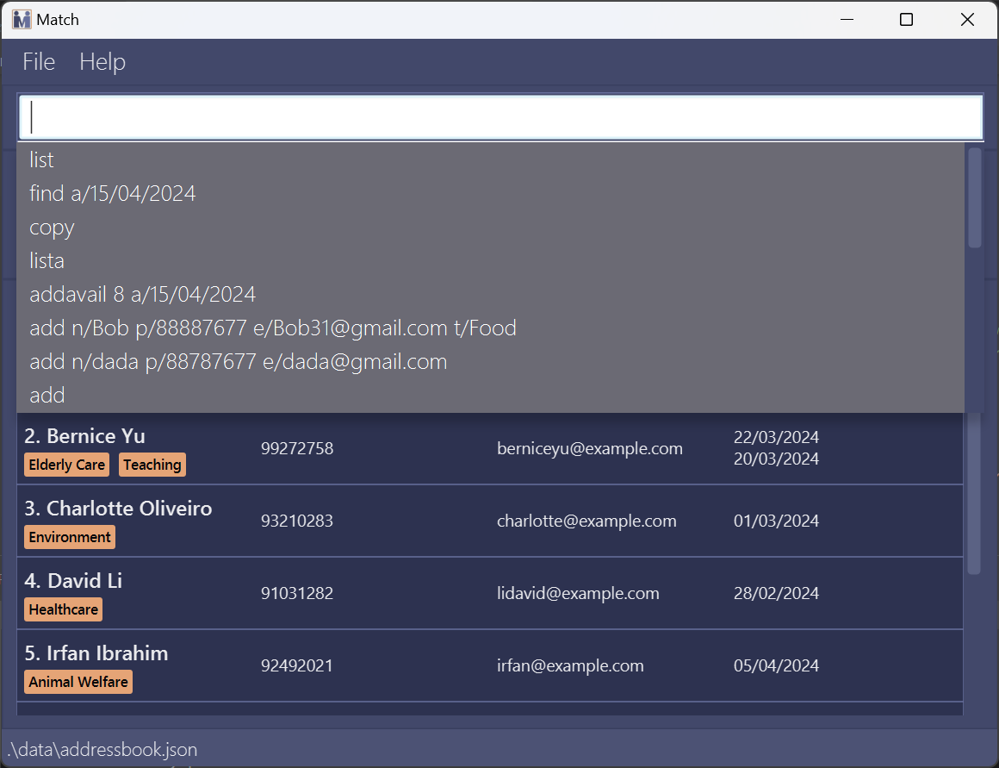
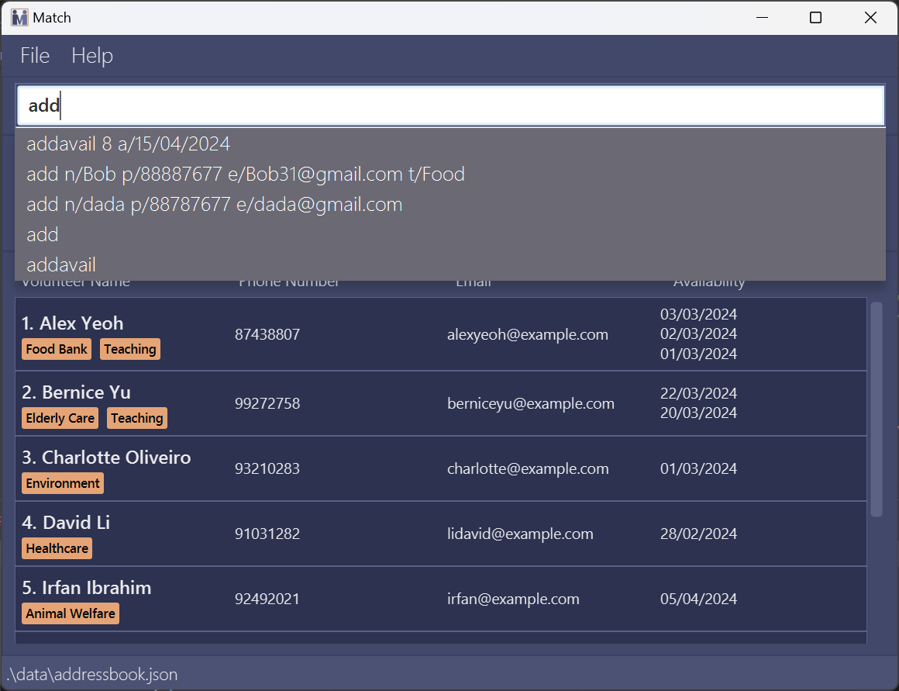

<br>


<br>

Welcome to Match :mage:!

Your premier **desktop app for volunteer coordinators** to keep track of volunteer contacts as well as assign volunteering assignments to them.

We are **optimized for use via a Command Line Interface** (CLI) while still having the benefits of a Graphical User Interface (GUI). If you can type fast, Match can get your contact management tasks done faster than traditional GUI apps.

Master the wand and become the ultimate task wizard :mage:.

Key features include:
- Fast Volunteer Addition
- Effortless Editing
- Simplified Searching
- Volunteer Work Assignment

---

<div style="page-break-after: always;"></div>

Table of Contents

- Table of Contents
{:toc}

---

<div style="page-break-after: always;"></div>

## Using this Guide

This user guide (UG) is your companion in **unlocking the full potential** of Match. It’s here to help you understand the app and leverage its features to manage your volunteers like never before.

### Glossary

When using Match, you will encounter the symbols and terms explained below:

| Symbol               | Meaning                                      |
|----------------------|----------------------------------------------|
| :information_source: | Important information                        |
| :exclamation:        | Warning or caution                           |
| :bulb:               | Additional information such as tips or notes |

The following glossary clarifies commonly-used terminology:

| Phrases          | Meaning                                                                                           |
|------------------|---------------------------------------------------------------------------------------------------|
| GUI              | Graphical User Interface, the visual display of Match.                                            |
| GUI component    | Parts that make up the GUI. For details, refer to [Navigating the GUI](#navigating-the-gui).      |
| CLI              | Command Line Interface, a text-based way to interact with Match.                                  |
| Command          | Input from the user telling Match to perform an action. See [Command Summary](#command-summary).  |
| Prefix           | Fields in a command to fill up, capturing important information.                                  |
| Case-sensitive   | Casing of alphabetic characters matters (e.g., “add” ≠ “ADD”).                                    |
| Case-insensitive | Casing of alphabetic characters doesn't matter (e.g., “john” = “JOHN”).                           |
| Contact card     | Box displaying each volunteer's details.                                                          |


## Quick start

1. Ensure you have Java `11` or above installed in your Computer for the magic to work :magic_wand:.

2. Download our latest `match.jar` from [here](https://github.com/AY2324S2-CS2103T-F10-4/tp/releases).

3. Copy the file to the folder you want to use as the _home folder_ for your Match.

4. **For Windows:window: users:**
   1. Open up Windows Search by pressing on the 'Windows' key and type `Command Prompt` or `Terminal`.
   2. Run `cd [JAR file location]` then run `java -jar match.jar` command to open up app.<br>
   Example:
   ```shell
    cd "C:\Users\John\My favourite location"
   java -jar match.jar
    ```

5. **For Linux:penguin: / macOS:apple: users:**
    1. Open up the search utility by pressing on the `Command` + `Space bar` key and type `Terminal`.
    2. Run `cd [JAR file location]` then run `java -jar match.jar` command to open up app.<br>
       Example:
   ```bash
    cd "~/John/My favourite location"
   java -jar match.jar
   ```
6. A GUI similar to the below should appear in a few seconds. Note how the app contains some sample data.<br>


5. Type the command in the command box and press Enter to execute it. e.g. typing `help` and pressing `Enter` will open the help window.<br>
   Some example commands you can try :smile::

   - `list` : Lists all volunteers.

   - `add n/John Doe p/98765432 e/johnd@example.com a/25/05/2025` : Adds a contact named `John Doe` to the volunteer contacts.

   - `delete 3` : Deletes the 3rd contact shown in the current list.

   - `clear` : Delete all contacts.

   - `exit` : Exits the app.

6. Refer to the [Features](#features) below for details of each command.

---

<div style="page-break-after: always;"></div>

## Navigating the GUI

Match has a Graphical User Interface (GUI) that provides a pleasant visual experience on top of comprehensive functionality.
Here is a quick look at the **two** different tabs present in Match:

### Volunteers Tab
Volunteers tab is the default tab, displaying all volunteers :ok_man: and their availability on a single screen. This view is useful for finding volunteers, which you will learn how to accomplish later!


<div style="page-break-after: always;"></div>

### Assignments Tab
Assignments tab is the alternate tab that displays all assignments :briefcase:. This view helps you manage all the assignments for your volunteers.


---

<div style="page-break-after: always;"></div>

## Features

<div markdown="block" class="alert alert-info">

**:information_source: Notes about the command format:**<br>

- Words in `UPPER_CASE` are the parameters to be supplied by the user.<br>
  e.g. in `add n/NAME`, `NAME` is a parameter which can be used as `add n/John Doe`.

- Command are case-sensitive and are to be  in `lower_case`. <br>
  e.g. in `add n/NAME`, `add` is a command which should be in lower-case.

- Items in square brackets are optional.<br>
  e.g `n/NAME [t/TAG]` can be used as `n/John Doe t/elderly` or as `n/John Doe`.

- Items with `…`​ after them can be used multiple times including zero times.<br>
  e.g. `[t/TAG]…​` can be used as ` ` (i.e. 0 times), `t/elderly`, `t/climate t/hospital` etc.

- Parameters can be in any order.<br>
  e.g. if the command specifies `n/NAME p/PHONE_NUMBER`, `p/PHONE_NUMBER n/NAME` is also acceptable.

- Extraneous parameters for commands that do not take in parameters (such as `help`, `list`, `exit` and `clear`) will be ignored.<br>
  e.g. if the command specifies `help 123`, it will be interpreted as `help`.

* If you are using a PDF version of this document, be careful when copying and pasting commands that span multiple lines as space characters surrounding line-breaks may be omitted when copied over to the application.

</div>

<font color="green">Now let us begin your wizardry journey as you acquire new spells to slay the work monsters :space_invader:.</font>

### Adding a volunteer: `add`

Never lose count of your volunteers :muscle:, add a volunteer to your volunteer contacts.

Format: `add n/NAME p/PHONE_NUMBER e/EMAIL [a/AVAILABILITY]… [t/TAG]…​`
- NAME :abc:
  - Only accepts spaces and alphanumeric characters.
  - Does not allow for duplication. You will be not allowed to add 2 volunteers with the 'same' name. the following points will explain what is considered 'same'.
  - For flexibility, upper and lower cases are considered distinct. <br>
  e.g. `Bob` and `bob` are considered 2 different entities.
  - The number of spaces entered will be registered. <br>
  e.g. `John[space]Doe` is different from `John[space][space]Doe`.
- PHONE_NUMBER :1234:
  - Only accepts numbers.
  - Must be at least 3 digits in length.
  - Does not allow for duplication.
- EMAIL :symbols:
  - Format: `[local-part]@[domain-name]`
  - local-part:
    - Accepts special characters `+_.-` in addition to alphanumeric characters. 
    - Nevertheless, special characters must not be consecutive and local-part cannot begin or end with a special character.
  - domain-name:
    - Domain labels (cannot be empty), separated by `.`, make up the domain name. <br>
    e.g. `example.com`is valid while `example..com` is not valid.
    - Domain label can only be alphanumeric characters, separated by a single hyphen (if any). However, ending domain label should not contain any hyphens.
    - Ending domain label needs to include a minimum of two characters.
- AVAILABILITY :calendar: - refer to [addavail](#adding-availabilities--addavail).
- TAG :name_badge:
  - Only accepts spaces and alphanumeric characters.

<div markdown="span" class="alert alert-primary">:bulb: **Tip:**

A volunteer can have any number of tags and any number of availabilities (including 0)

</div>

<div markdown="block" class="alert alert-info">

**:information_source: Take note:**<br>

- You can use tags of any length, but tags that are longer than 25 characters will be truncated when they are shown.
- Similarly, phone numbers and emails that are too long (more than ~ 40 characters) will be truncated.

</div>

Examples:

- `add n/John Doe p/98765432 e/johnd@example.com a/22/05/2024`
- `add n/Betsy Crowe t/elderly e/betsycrowe@example.com a/25/05/2024 p/1234567 t/wildlife`

What you should see:


### Editing a volunteer : `edit`

Looks like someone changed their information, did they finally admit their phone number isn’t ‘12345678’? :relieved: Use this to edit an existing volunteer in the volunteer contacts.

Format: `edit INDEX [n/NAME] [p/PHONE] [e/EMAIL] [a/AVAILABILITY]… [t/TAG]…​`
- Edits the volunteer at the specified `INDEX`. The index refers to the index number shown in the displayed volunteer list. The index **must be a positive integer** 1, 2, 3, …​
- At least **one** of the optional fields must be provided.
- **Existing values** will be updated to the input values if they are valid.

<div markdown="block" class="alert alert-info">

**:information_source: Take note:**<br>

- When editing tags, the existing tags of the volunteer will be removed i.e. editing of tags are **not cumulative**. <br>
  e.g. `edit 1 t/newTag` will result a single tag `newTag` for volunteer at index 1.
- You can **remove all** the volunteer’s tags by typing `t/` without specifying any tags after it.
- Constraints for email, phone number and tag(s) are similar to that of [add](#adding-a-volunteer-add) command.

</div>

Examples:

- `edit 1 p/91234567 e/johndoe@example.com` edits the phone number and email address of the 1st volunteer to `91234567` and `johndoe@example.com` respectively.
- `edit 2 n/Betsy Crower t/` edits the name of the 2nd volunteer to `Betsy Crower` and clears all existing tags.

What you should see:


### Adding availabilities : `addavail`

Yay looks like someone is free on that day :smiley:! Quickly add the available dates to the volunteer.

Format: `addavail INDEX a/AVAILABILITY`
- Adds availabilities to volunteer at the specified `INDEX`. This index refers to the index number shown in the displayed volunteer list. <br>
  The index **must be a positive integer** 1, 2, 3, …​
- Availability must be in the format of DD/MM/YYYY e.g. `28/03/2024`.
- Duplicate availability for one volunteer is not allowed.

Examples:

- `addavail 1 a/01/01/2024`
- `addavail 2 a/02/03/2024 a/03/03/2024`

What you should see:


### Removing availabilities : `removeavail`

Uh oh seems like your volunteer is busy :anguished:, hurry and remove the available dates from the volunteer.

Format: `removeavail INDEX a/AVAILABILITY`

- Removes availabilities from volunteer at the specified `INDEX`. The index refers to the index number shown in the displayed volunteer list. The index **must be a positive integer** 1, 2, 3, …​
- Availability must be in the format of DD/MM/YYYY e.g. `28/03/2024`.
- Availability must be present at the index in order to remove.

Examples:

- `removeavail 1 a/01/01/2024`
- `removeavail 2 a/02/03/2024 a/03/03/2024`

<div markdown="block" class="alert alert-warning">
:exclamation: **Caution:**
Removing an availability will cascade delete all assignments affected. For example, if Alice has an assignment on 14/04/2024 and that availability is removed, that assignment will also be removed.
</div>

What you should see:


### Listing all volunteers : `list`

See everything :eyes:! Displays the [volunteer list](#volunteers-tab) with all volunteer contacts.

Format: `list`

What you should see:


### Locating volunteers by name: `find`

Looking for something specific :thinking:? Use this to find and display a filtered volunteer list containing volunteers matching the search.

Format: `find [n/NAME]… [a/AVAILABILITY]…`

- The search is case-insensitive. e.g `hans` will match `Hans`
- At least one of the optional fields must be provided.
- The order of the keywords does not matter. e.g. `Hans Bo` will match `Bo Hans`
- Partial words will be matched e.g. `Han` will match `Hans`
- Volunteers matching at least one keyword will be returned (i.e. `OR` search).
  e.g. `Hans Bo` will return `Hans Gruber`, `Bo Yang`

Examples:

- `find n/John` returns `john`, `John`, `John Doe` and so on...
- `find n/alex david` returns `Alex Yeoh`, `David Li`<br>
- `find n/alex n/david` returns `Alex Yeoh`, `David Li`
- `find a/23/05/2024` returns volunteers who are available on `23/05/2024`
- `find a/23/05/2024 a/24/05/2024` returns volunteers who are available on either `23/05/2024` or `24/05/2024`
- `find n/alex a/23/05/2024` returns volunteers with `alex` in name or volunteers available on `a/23/05/2024`

What you should see after `find n/John`:


### Deleting a volunteer : `delete`

Forgive and forget :broken_heart:, deletes the specified volunteer that are no longer with us from the volunteer contacts :slightly_frowning_face:.

Format: `delete INDEX`

- Deletes the volunteer at the specified `INDEX`.
- The index refers to the index number shown in the displayed volunteer list.
- The index **must be a positive integer** 1, 2, 3, …​

<div markdown="block" class="alert alert-info">

**:information_source: Take note:**<br>

- As delete is deemed as a critical operation, you will see a confirmation message.

- Do not panic, entering `y` following it will delete proceed to delete the specified entry, while entering anything else will default to cancelling the operation.

- Deleting a person will result in the person assigned to an assignment to be deleted as well.

</div>

Examples:

- `list` followed by `delete 2` deletes the 2nd volunteer in the volunteer contacts.
- `find Betsy` followed by `delete 1` deletes the 1st volunteer in the results of the `find` command.

<div markdown="block" class="alert alert-warning">
:exclamation: **Caution:**
Remove a volunteer will also remove all of his/her assignments. Be careful with removing volunteers.
</div>

### Clearing all entries : `clear`

Start anew :new:, clear all volunteer entries from the volunteer contacts when everything is over.

Format: `clear`

<div markdown="block" class="alert alert-info">

**:information_source: Take note:**<br>

- As clear is deemed as a critical operation, you will see a confirmation message.

- Do not panic, entering `y` following it will delete proceed to delete the specified entry, while entering anything else will default to cancelling the operation.

</div>

### Assigning volunteers : `assign`

Never forget another volunteering assignment :thumbsup:, add an assignment to a volunteer.

Format: `assign INDEX d/ASSIGNMENT_DETAILS a/AVAILABILITY`

- Assigns the volunteer at the specified `INDEX`. The index refers to the index number shown in the displayed volunteer list. The index **must be a positive integer** 1, 2, 3, …​
- Availability must be in the format of DD/MM/YYYY eg: `28/03/2024`
- The volunteer at the specified `INDEX` must be available on the `AVAILABILITY` entered.
- Each volunteer can only be assigned 1 volunteer activity per day.
- `ASSIGNMENT_DETAILS` must be alpha-numeric and cannot be empty. eg: `Willing Hearts`

<div markdown="span" class="alert alert-primary">:bulb: **Tip:**
The index here works the same way as Edit!
</div>

Examples:

- `assign 1 d/Tutoring a/01/01/2024`
- `assign 2 d/Elderly Care a/02/03/2024`

What you should see:


### Listing all assignments : `lista`

See everything :eyes:! Displays the [assignment list](#assignments-tab) with all assignments.

Format: `lista`

<div markdown="span" class="alert alert-primary">:bulb: **Tip:**
To switch back to volunteer list, type `list`
</div>


### Remove assignments : `removeassign`

Oh, no the assignment has been cancelled :open_mouth:. Use this to remove an assignment from the assignment list.

Format: `removeassign INDEX`

- Removes the assignment at that `INDEX`. The index refers to the index number shown in the assignment list. The index **must be a positive integer** 1, 2, 3, …​

<div markdown="block" class="alert alert-info">

**:information_source: Take Note:**<br>

- This command can still run when the **volunteer list** is being displayed. The assignment removed will be the assignment with `INDEX` in the **assignment list**.

</div>

Examples:
`removeassign 1`
`removeassign 2`

### Refreshing availabilities : `refresh`

Keep your data sparkling clean :sparkles:, remove any outdated availabilities based on the today's date from volunteer contacts.

Format: `refresh`

<div markdown="block" class="alert alert-warning">
:exclamation: **Caution:**
Similar to removing availabilities, refresh will cascade delete all assignments affected. For example, if Alice has an assignment on 14/04/2024 and that availability is removed, that assignment will also be removed. 
</div>

### Copying emails : `copy`

Remember the good old `Ctrl` + `c`? Copies the email addresses of all volunteers in the currently filtered volunteer list to the clipboard.

Format: `copy`
- The email addresses will be copied in a comma-separated format, e.g. `john@example.com, jane@example.com, ...`.
- An error message will appear if the filtered volunteer list contains no volunteers.

<div markdown="block" class="alert alert-info">

**:information_source: Take Note:**<br>

- This command can still be used when the **assignment list** is being displayed. All volunteers' email addresses will be copied.

</div>

Examples:

- `list` followed by `copy` copies all email addresses in the app.
- `find n/john` followed by `copy` copies the email addresses of volunteers whose names contain "john".

What you should see:

After pasting copied emails into Gmail:


### Exporting to CSV: `export`

Impress your boss :man_office_worker: with this your own custom report from CSV. Export your way to victory :trophy:! Exports volunteer and assignment data to a comma-separated values (CSV) file located at `[JAR file location]/data`. Both volunteers and assignments are exported as `persons.csv` and `assignments.csv` respectively.

Format: `export`

<div markdown="block" class="alert alert-info">

**:information_source: Take Note:**<br>

- When using the application for the first time, executing the `export` command when the `addressbook.json` is missing will result in an error. Try executing other commands first. This will result `addressbook.json` file to be created.
- When the `persons.csv` or `assignments.csv` files are being used by another application running `export` command will result in an error.

</div>

### Viewing help : `help`

I am too noob :cry:, will someone help me? Never fear this shows a message explaining how to access the help page.

Format: `help`

What you should see:<br>


### Exiting the program : `exit`

Sad to see you go :frowning_face:, this exits the program.

Format: `exit`

### Accessing the command history

Superpower to see the past :superhero:.

To access the command history:

- From the input field, press the down arrow key (↓) to bring out the drop-down menu of previous commands.
- Use the up (↑) and down (↓) arrow keys to navigate through the command history.

<div markdown="block" class="alert alert-info">

**:information_source: Take Note**<br>
- After you enter a command, the command history will automatically close. If you wish to close the command history manually, you have two options:
    1. Press the `Ctrl` key on your keyboard.
    2. Click anywhere outside of the command history dropdown.
- Long input commands will be truncated when viewed in the command history. This has no effect on the functioning of the command history or the execution of previous commands.

</div>

What you should see:<br>


### Using the autocomplete

Become the fastest typist :keyboard:! Autocomplete provides suggestions based on your command history as you type. You can navigate through the suggestions using the arrow keys, similar to the command history.

What you should see:<br>


### Saving the data

Match data are saved in the hard disk automatically after any command that changes the data. There is no need to save manually.

### Data cascading

As `persons` and `assignments` list are related performing actions on one of the lists will result changes to be cascaded to ensure data consistency.

### Editing the data file

Match data are saved automatically as a JSON file `[JAR file location]/data/addressbook.json`. Advanced users are welcome to update data directly by editing that data file.

<div markdown="span" class="alert alert-warning">
:exclamation: **Caution:**
If your changes to the data file makes its format invalid, Match will discard all data and start with an empty data file at the next run. Hence, it is recommended to take a backup of the file before editing it.<br>
Furthermore, certain edits can cause the Match to behave in unexpected ways (e.g., if a value entered is outside of the acceptable range). Therefore, edit the data file only if you are confident that you can update it correctly.
</div>

<font color="green">Congratulations you have mastered all the elements you are now a qualified wizard :mage:!</font>

## FAQ

**Q**: How do I transfer my data to another Computer?<br>
**A**: Install the app in the other computer and overwrite the empty data file it creates with the file that contains the data of your previous Match home folder.


**Q**: Why are all of my volunteers and assignments suddenly gone?<br>
**A**: The problem is most likely that your JSON file is corrupted or edited. Be careful on not to edit your JSON file directly and only use commands to do so.You can solve this by manually adding your volunteers and assignments again.

---

## Known issues

1. **When using multiple screens**, if you move the application to a secondary screen, and later switch to using only the primary screen, the GUI will open off-screen. The remedy is to delete the `preferences.json` file created by the application before running the application again.
2. **Invisible input caret**, there are times when the input caret (cursor) may become invisible even though the input field has focus. To resolve this, regain focus in the input field by pressing the Tab key a few times.

---

<div style="page-break-after: always;"></div>

## Command summary

Action | Format, Examples
--------|------------------
**Add** | `add n/NAME p/PHONE_NUMBER e/EMAIL [a/AVAILABILITY]… [t/TAG]…​`<br> e.g., `add n/James Ho p/96311212 e/jamesho@example.com a/25/05/2024 t/elderly t/food`
**Edit** | `edit INDEX [n/NAME] [p/PHONE] [e/EMAIL] [a/AVAILABILITY]… [t/TAG]…​`<br> e.g.,`edit 2 n/James Lee e/jameslee@example.com`
**Add Availability** | `addavail INDEX a/AVAILABILITY`<br> e.g., `addavail 1 a/01/01/2024`
**Remove Availability** | `removeavail INDEX a/AVAILABILITY`<br> e.g., `removeavail 1 a/01/01/2024`
**List** | `list`
**Find** | `find [n/NAME]… [a/AVAILABILITY]…`<br> e.g., `find n/James n/Jake`
**Delete**[^1] | `delete INDEX`<br> e.g., `delete 3`
**Clear**[^1] | `clear`
**Assign** | `assign INDEX d/ASSIGNMENT_DETAILS a/AVAILABILITY`<br> e.g., `assign 1 d/Food Distribution a/01/01/2024`
**List Assignments** | `lista`
**Remove Assignments** | `removeassign INDEX`<br> e.g. `removeassign 1`
**Refresh** | `refresh`
**Copy** | `copy`
**Export** | `export`
**Help** | `help`
**Exit** | `exit`

[^1]: Are critical operations and will have an additional confirmation step.
